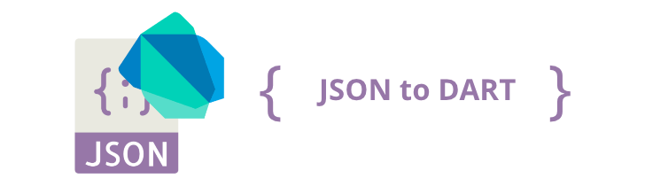

<!-- LOGO -->
<p align="center">

</p>

<!-- BADGES -->
<p align="center">
<a href="https://marketplace.visualstudio.com/items?itemName=hirantha.json-to-dart"></a>
<a href="https://marketplace.visualstudio.com/items?itemName=hirantha.json-to-dart"></a>
<a href="https://marketplace.visualstudio.com/items?itemName=hirantha.json-to-dart"></a>
<a href="https://www.hirantha.xyz"></a>
<a href="https://github.com/hiranthaR/Json-to-Dart-Model/issues"></a>
<a href="https://opensource.org/licenses/MIT"></a>
<a href="https://dart.dev/guides/language/effective-dart/style"></a>
<a href="https://github.com/rrousselGit/freezed"></a>
<a href="https://github.com/google/json_serializable.dart/tree/master/json_serializable"></a> 
<a href="https://dart.dev/null-safety"></a>
</p>

> From JSON to Dart Advanced

<!-- TABLE OF CONTENTS -->
<details open="open">
  <summary>Table of Contents</summary>
  <ol>
    <li> <a href="#features">Features</a>
      <ul>
        <li><a href="#convert-from-clipboard-to-manual-model-classes">Convert from clipboard</a></li>
        <li><a href="#convert-from-selection-to-manual-model-classes">Convert from selection</a></li>
        <li><a href="#convert-from-clipboard-to-code-generation-libraries-supported-model-classes">Convert from clipboard to code generation</a></li>
        <li><a href="#convert-from-selection-to-code-generation-libraries-supported-model-classes">Convert from selection to code generation</a></li>
        <li><a href="#convert-from-file">Convert from file</a></li>
        <li><a href="#convert-from-directory">Convert from directory</a></li>
        <li><a href="#annotations">Annotations</a></li>
        <li><a href="#speed-up-converting">Speed up converting</a></li>
        <li><a href="#enhanced-file-names">Enhanced file names</a></li>
        <li><a href="#context-actions">Context actions</a></li>
        <li><a href="#avoid-dynamic-types">Avoid dynamic Types</a></li>
        <li><a href="#suffix-for-from-and-to">Suffix for from/to</a></li>
        <li><a href="#codecs">Codecs encode/decode</a></li>
      </ul>
    <li>
      <a href="#the-syntax">The Syntax</a>
      <ul>
        <li><a href="#to-string-method">toString method</a></li>
        <li><a href="#copywith-method">copyWith method</a></li>
        <li><a href="#equality-operator">Equality Operator</a></li>
        <li><a href="#equatable">Equatable</a></li>
        <li><a href="#null-safety">Null safety</a></li>
      </ul>
    </li>
    <li><a href="#supported-generators">Supported Generators</a></li>
    <ul>
        <li><a href="#freezed">Freezed</a></li>
        <li><a href="#json-serializable">JSON Serializable</a></li>
    </ul>
    <li><a href="#how-to-use">How to use</a></li>
    <ul>
        <li><a href="#customize">Customize</a></li>
        <li><a href="#key-bindings">Key bindings</a></li>
        <li><a href="https://pub.dev/packages/freezed">Freezed documentation</a></li>
        <li><a href="#converter">Converter</a></li>
        <li><a href="#known-issues">Known Issues</a></li>
        <li><a href="#links">Links</a></li>
    </ul>
  </ol>
</details>

<space><space>

Given a JSON string, this library will generate all the necessary Dart classes to parse and generate JSON in a safe way becouse generator support `jsonc` and `json`. Also designed to generate Flutter-friendly model classes following the [Flutter's doc recommendation](https://flutter.io/json/#serializing-json-manually-using-dartconvert) and [Effective Dart: Style](https://dart.dev/guides/language/effective-dart/style).  Extention supports for both **Serializing JSON manually** and **Serializing JSON** using code generation libraries like **Freezed** and **Json Serializable**.

> **Note:** when you use `Freezed` or `Json Serializable` then `Json to Dart Model` generates only types and everything that happens after, then `Dart Build System builders` takes care of the rest and is responsible for generated code.

<!-- HOW IT WORKS -->
## How it Works

`Dart to Json Model Generator` creates your JSON object into separate files and thanks to this if similar structures are detected generator will create them into different files and merge them with path (`import`) no matter how named your objects are. In this way, you can keep your code cleaner and more readable. The pathname in the first will be renamed with the class name added as a prefix to show from which class the objects are. If the names continue to be duplicated then will be marked with the index for infinity renaming.

- Avoid using file base class names as JSON keys to avoid conflicts and unwanted change of structure names. Note: converting from file `Json to Dart Model` will help to avoid it.
- Properties named with funky names (like "!breaks", "|breaks", etc) will produce syntax errors.

<!-- CUSTOMIZE -->
## Customize

To customize your classes is very easy. If you want fast to create a simple class then just click enter continue to skip all methods. Otherwise, build your own. To generate Freezed class and Json Serializable choose Code Generation. Of course, you can set up your configuration in the `Settings/Extensions/JSON To Dart Model`

<!-- HOW TO CUSTOMIZE GIF -->
<p align="center">

</p>

<!-- FEATURES -->
## Features

### Convert from clipboard to manual model classes

- Convert JSON you copied into dart model classes.

### Convert from selection to manual model classes

- Convert JSON you selected into dart model classes.

### Convert from clipboard to code generation libraries supported model classes

- Convert JSON you copied into code generation libraries supported model classes. A terminal session runs after conversion to generate the rest parts.

### Convert from selection to code generation libraries supported model classes

- Convert JSON you selected into code generation libraries supported model classes. A terminal session runs after conversion to generate the rest parts.

### Convert from file

- Convert all JSON objects from the file.

`Json to Dart Model` generator keeps all your JSON objects in the file with the name `models.jsonc` and allows you to configure your classes according to your preferences. `models.jsonc` content is a list that contains all of your JSON objects that will later be converted to Dart classes. The `jsonc` format allows you to comment on your JSON objects to easily find them later or make it easier to explain to your team. To create the `models.jsonc` file you can run command in the command palette `Build Models` or use keys binging `Shift + Ctrl + Alt + B` and you will be asked if you want to create a file, hit Enter to add the file. To configure options for output, go to the `Settings/Extensions/JSON To Dart Model`

**Create file manually**. Just add a new file to your app directory `my_app/models.jsonc` and put all JSON objects to the list separated by commas for multi JSON conversions at once. **Note that you add base class names to each object with key** `"__className": "MyClass",` the class name will be removed from the object and used as the root class name for your code syntax. Duplicate class names are not allowed to avoid overwriting the files. Inside your `models.jsonc`. By adding key `__path` you can override the default path and navigate your models where you want and how your want in your workspace. File should look like this:

#### Single JSON conversion
```jsonc
{
  "__className": "user_post", // <- The base class name of the object.
  "__path": "/lib/models/user_post", // <- override default path with a new one by adding '__path' key.
  "userId": 1,
  "id": 1, // To mark as required value, change "id" to "r@id".
  "title": "Json To Dart Model", // To mark as a default value, change "title" to "d@title".
  "body": "Json to Dart advanced..."
}
```
#### Multiple JSON conversion
```jsonc
[
  {
    "__className": "class_one",
    /* ... */
  },
  {
    "__className": "class_two",
    /* ... */
  }
]
```

After adding the object and convert to Dart classes just run a command from the [command palette](#how-to-use) or simpler use key binding `Shift + Ctrl + Alt + B`. If you want to update some class, just delete the class folder from the directory and run again `Build Models` and `Json to Dart Model` will generate the missing directory.

<!-- CONVERT FROM DIRECTORY -->
## Convert From Directory

If you are converting `JSON` models from the `models.jsonc` file and it has become too large. Then you can split it inside the `/.json_models` directory. And generator will read all of them and will convert in the same way as from the models.jsonc. Inside the tracked directory supported files are `**.json` and `**.jsonc`  the rest will be ignored. Of course, you can use both tracked locations at the same time `my_app/models.jsonc` and `my_app/.json_models` the generator track the both locations.

<!-- ENHANCED FILE NAMES -->
## Enhanced File Names

Enhanced file names like `user.model.dart` can make you code friendly with other converters such as like [Hive Object Converter](https://marketplace.visualstudio.com/items?itemName=mrgnhnt96.hive-object-converter). To create it you just need to separate your class name with a dot and after the dot, everything will be added as an enhancement name. Example: `user.model` result `user.model.dart`. Just that.

<!-- CONTEXT ACTIONS -->
## Context Actions

Convert JSON from the right mouse button context menu.

 - Select any folder and run the available method to start conversion.
 - Select the JSON code inside the file `**.json` or `**.jsonc`, click the right mouse button, and run the available method to start conversion.
 - Click the right mouse button on the `models.jsonc` file, and run the available method to start conversion.

<!-- ANNOTATIONS -->
## Annotations

It is possible to mark `JSON` values as default or required. Everything that do you need to do, just add to your `JSON` key `d@` or `r@` and Json to Dart Model will generate them for you.

- `d@` - Marks as default value.
- `r@` - Marks as required value.

```jsonc
{
  "r@id": 1,
  "d@title": "Json To Dart Model"
}
```

Result:

```dart
class Example {
  int id;
  String title;

  Example({required this.id, this.title = 'Json To Dart Model'});
  
  // The rest...
}
```

This also works with Freezed and JSON Serializable, also initializes non-constant values like `DateTime` if marked as default.

> **Note:** what happens if I use multiple annotations `"r@d@key"` then the generator will prioritize the default value and generate value as the default since only named parameters without a default value can be with required.

<!-- SPEED UP CONVERTING -->
## Speed Up Converting

If you work a lot with JSON files and get tired every time customize your models in the command palette. Then you can go to the `Settings/Extensions/JSON To Dart Model` and set the primary configuration to `true`. And Json to Dart Model will use settings configuration everywhere and never ask you about input. Just choose any command from the selection or clipboard and pick the directory. Set fast mode to `true` for faster converting to the default directory.

<!-- AVOID DYNAMIC TYPES -->
## Avoid dynamic Types

By using Dart with null-safety you can activate in the setting avoid `dynamic` types and the generator will output `from/to` types as `Map<String, Object?>`. By following Dart standards, `List<dynamic>` type will not change because the default list type is `dynamic` in the Dart language. Also, it has no effect if you generate with code generator libraries because they use `dynamic` types anyway.

<!-- SUFFIX FOR FROM/TO -->
## Suffix for from and to 

The generator has default `Json` suffix for `from/to` methods. It is possible to change the extension settings or override by converting `JSON`.

<!-- JSON SERIALIZABLE -->
## JSON Serializable

Add serializing JSON using code generation libraries to `pubspec.yaml`

  structure of the `pubspec.yaml`  

  ```yaml
  dependencies:
    # Your other regular dependencies here
    json_annotation: <latest_version>

  dev_dependencies:
    # Your other dev_dependencies here
    build_runner: <latest_version>
    json_serializable: <latest_version>
  ```

<!-- FREEZED -->
## Freezed

Freezed supports both old versions to 0.12.7 and new from 0.14.0 and higher. Freezed requires three packages to generate JSON files to Freezed classes with a few clicks.
  
  structure of the `pubspec.yaml`

  ```yaml
   dependencies:
     # Your other regular dependencies here
     freezed_annotation: <latest_version>
 
   dev_dependencies:
     # Your other dev_dependencies here
     build_runner: <latest_version>
     freezed: <latest_version>
   ```

Read more about how to install [Freezed](https://pub.dev/packages/freezed#install).

All generated classes with Freezed will be `@immutable` and support all methods like `copyWith`, `toString`, equality operator`==`... See example:

```dart
@freezed
class Todo with _$Todo {
  factory Todo({
    @JsonKey(name: 'todo_id') int? todoId,
    String? description,
    bool? completed,
  }) = _Todo;

  factory Todo.fromJson(Map<String, dynamic> json) => _$TodoFromJson(json);
}
```

Freezed generator is useful for those who work daily with coding. All you have to do is upgrade some values and Freezed will take care of the rest. You don't need to worry that you have forgotten to update the parser to some method. More what you can do with Freezed read [Freezed documentation](https://pub.dev/packages/freezed).

> **TIP:** If you think that you have too many generated files you can look at tips by Freezed on how to [ignore lint warnings on generated files](https://pub.dev/packages/freezed#ignore-lint-warnings-on-generated-files).

<!-- EQUATABLE -->
## Equatable

Equatable is the immutable class with the ability to compare your generated models in a better way. You can check if 2 classes, which are different instances, are equals **_without a single line of extra code_**. Of course, you can add [toString](#to-string-method) method and [copyWith](#copyWith-method) for a better experience.

```dart
class Todo extends Equatable {
  final int? id;
  final String? description;
  final bool? completed;

  const Todo({this.id, this.description, this.completed});

  factory Todo.fromJson(Map<String, dynamic> json) => Todo(
        id: json['id'] as int?,
        description: json['description'] as String?,
        completed: json['completed'] as bool?,
      );

  Map<String, dynamic> toJson() => {
        'id': id,
        'description': description,
        'completed': completed,
      };

  // Here will be more methods after your customization.
  // toString();
  // copyWith();

  @override
  List<Object?> get props => [id, description, completed];
}
```

To add Equatable support you just have to select `Equatable` equality support when the process of parsing your JSON to Code has started and the extension will take care of setting up the advanced code equality check-in your Dart models.

<!-- EQUALITY OPERATOR -->
## Equality Operator

If you don't want to install the Equatable package and work with `@immutable` classes and values then you can add equality operator and customize your class as mutable. With utility from the Dart collection, make equality less boilerplate.

### Without null safety
```dart
@override
bool operator ==(dynamic other) {
  if(identical(other, this)) return true;
  if (other is! Todos) return false;
  final mapEquals = const DeepCollectionEquality().equals;
  return mapEquals(other.toJson() as Map, toJson());
}

@override
int get hashCode => userId.hashCode ^ id.hashCode ^ title.hashCode ^ completed.hashCode;
```
### With null safety
```dart
@override
bool operator ==(Object other) {
  if(identical(other, this)) return true;
  if (other is! Todos) return false;
  final mapEquals = const DeepCollectionEquality().equals;
  return mapEquals(other.toJson(), toJson());
}

//..
```

<!-- TO STRING METHOD -->
## To String Method

You can add `toString` method in your classes to improve the debugging experience.

```dart
@override
String toString() {
  return 'Todos(userId: $userId, id: $id, title: $title, completed: $completed)';
}
```

Equatable can implement [toString](https://github.com/felangel/equatable/blob/master/README.md#tostring-implementation) method including all the given props. If you want that behaviour, just have to select `Stringify` method when the process of parsing your JSON to Code has started.

```dart
@override
bool get stringify => true;
```

<!-- COPY WITH METHOD -->
## CopyWith Method

`copyWith` method will make your life easier with `@immutable` classes. Highly recommended with immutable classes.

```dart
Todo copyWith({
  int? id,
  String? description,
  bool? completed,
}) {
  return Todo(
    id: id ?? this.id,
    description: description ?? this.description,
    completed: completed ?? this.completed,
  );
}
```

<!-- CODECS -->
## Codecs

Enabling codecs will implement `fromMap/toMap` methods with `encode/decode` inside the `fromJson/toJson` methods.

<!-- NULL SAFETY -->
## Null Safety

Null-Safety is enabled as default like in Dart language and it will indicate that a variable may have the value null. To disable it, go to the `Settings/Extensions/JSON To Dart Model`.

> **Note:** make sure your packages also support Dart null safety.

<!-- SERIALIZING JSON USING CODE GENERATION LIBRARIES -->
## Serializing JSON Using Code Generation Libraries

If you'd like to use Code Generation Libraries from Flutter, first of all, I suggest you add dependencies to the `pubspec.yaml` file. It also can be done with this extension. You don't need to worry about it :wink: After that, you can convert your JSON to model classes. Then you need to run the `flutter pub run build_runner build` command to generate the missing code of the models, according to Flutter documentation. Fortunately, the extension automatically opens a new terminal session and runs that command for you, yey :smile:

- Read more about [flutter's doc recommendation](https://flutter.io/json/#serializing-json-manually-using-dartconvert) about **JSON and serialization**

<!-- HOW TO USE -->
## How To Use

1. Select a valid JSON. Press `Ctrl + shift + P` (Linux and Mac) or `Ctrl + P` (Windows) and search for `Convert From Selection` or `Convert From Selection To Code Generation Supported Classes`. Provide a Base class name and location to save.

2. Copy a valid JSON. Press `Ctrl + shift + P` (Linux and Mac) or `Ctrl + P` (Windows) and search for `Convert From Clipboard` or `Convert From Clipboard To Code Generation Supported Classes`. Provide a Base class name and location to save.

3. Press `Ctrl + shift + P` (Linux and mac) or `Ctrl + P` (Windows) and search for `Add Code Generation Libraries To pubspec.yaml` and hit enter.

4. Press `Ctrl + shift + P` (Linux and Mac) or `Ctrl + P` (Windows) and search for `Build Models` and hit enter.

5. Using short cuts.

6. Convert from the right mouse button context.

<!-- KEY BINDINGS -->
## Key Bindings

Convert from Clipboard (`Shift + Ctrl + Alt + V`)

Convert from Selection (`Shift + Ctrl + Alt + S`)

Convert from file (`Shift + Ctrl + Alt + B`)

Convert from Clipboard to Code Generation supported classes (`Shift + Ctrl + Alt + G`)

Convert from Selection to Code Generation supported classes (`Shift + Ctrl + Alt + H`)

<!-- CONVERTER -->
## Converter

- Array type merging
- Duplicate type prevention
- Union types
- Optional types
- Array types

<!-- KNOWN ISSUES -->
## Known Issues

1. Using key binding on `Linux` can throw error `Command failed: xclip -selection clipboard -o` it happens when Linux lacks clipboard package. To resolve this error run in the terminal this command to install the missing package.

   ```bash
   sudo apt-get install xclip
   ```

2. Matches the wrong type. In my experience, some API deliverers write `integer` values instead of `double`, for example, 1 or 1.00 instead of 1.10. The problem is that this generator does a deep object scan and reads each item to detect the type of value and returns the type as found. But with lists works well, if the list only has `double` and `integers`, the list type returns as `num`. If you write yourself JSON objects try to give the right value type for better results. It’s all about JSON quality :sunglasses:

<!-- LINKS -->
## Links

- [Repository](https://github.com/hiranthar/Json-to-Dart-Model.git)
- [Issues](https://github.com/hiranthaR/Json-to-Dart-Model/issues)
- [Changelog](https://github.com/hiranthaR/Json-to-Dart-Model/blob/master/CHANGELOG.md)
- [Discussions](https://github.com/hiranthaR/Json-to-Dart-Model/discussions)

<!-- SPECIAL THANKS -->
## Special Thanks

:heart: Special thanks to [Israel Ibarra](https://github.com/ElZombieIsra) for adding [equatable](https://pub.dev/packages/equatable) support.</br>
:heart: Special thanks to [Arnas](https://github.com/iamarnas) for adding [Effective Dart: Styles](https://dart.dev/guides/language/effective-dart/style).</br>
:heart: Special thanks to [Ayush P Gupta](https://github.com/apgapg) for fixing bugs.

<!-- SUPPORT US -->
## Support us

If you like this, please give us the :star: and share with your friends. Thank you :blue_heart:

<!-- LICENSE -->
## License

Distributed under the MIT License. See `LICENSE` for more information.

<!-- CONTACT ME -->
## Contributors

<a href="https://github.com/hiranthaR/Json-to-Dart-Model/graphs/contributors">
  
</a>

